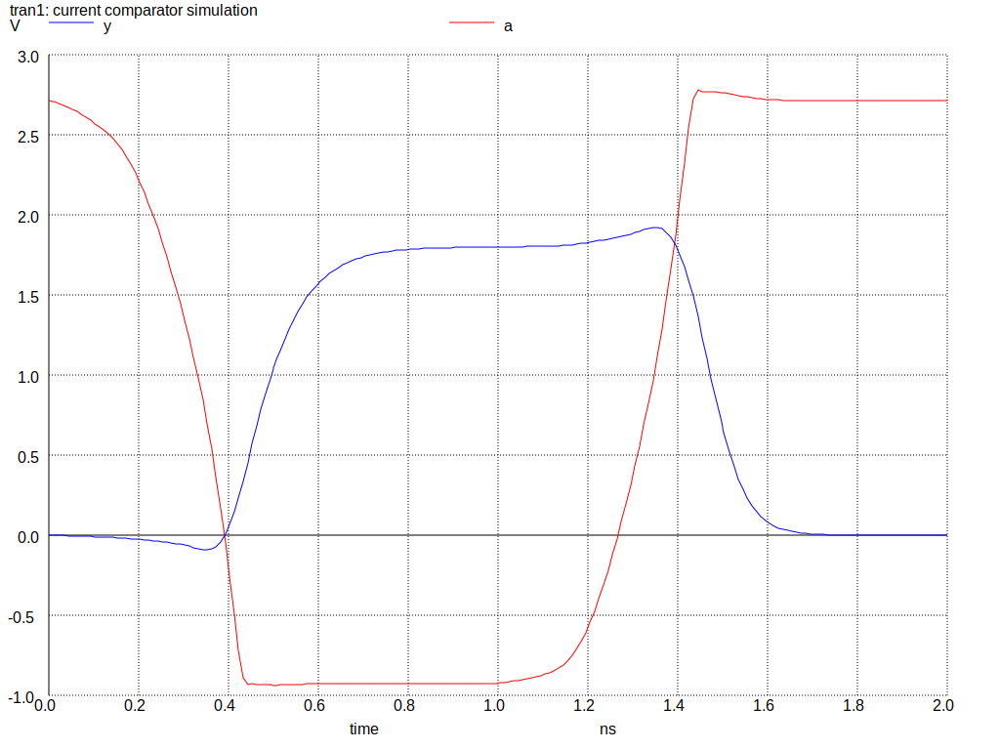
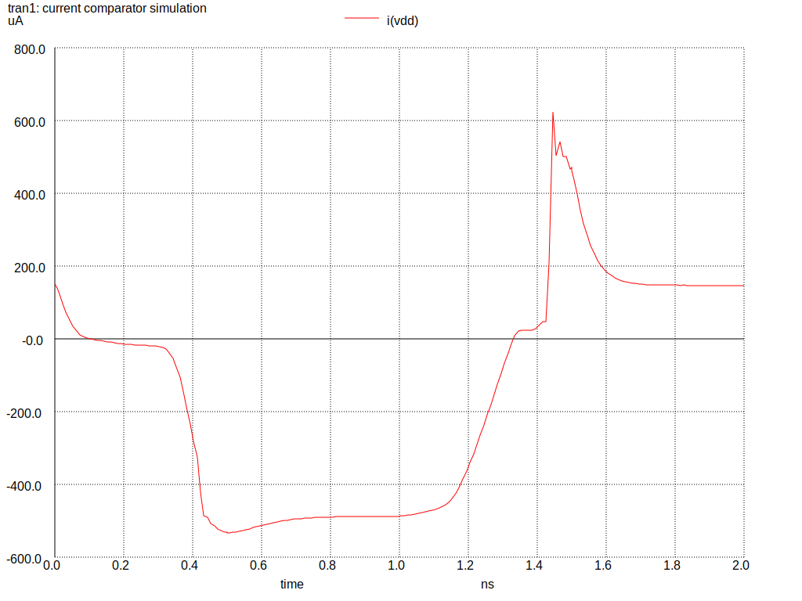
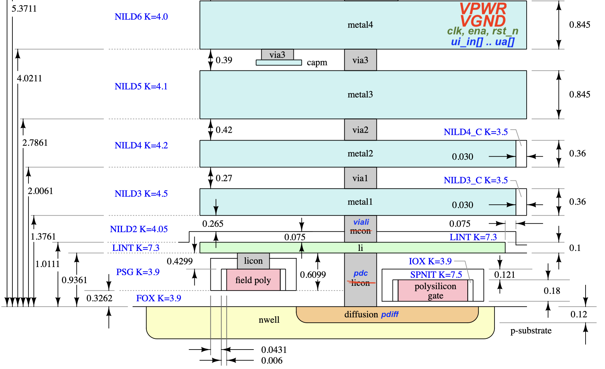

 

Example Matt's DAC: https://github.com/mattvenn/tt06-analog-r2r-dac

Also Matt's old inverter: https://github.com/mattvenn/magic-inverter

# Simulation results
<p align="center">
    
    
</p>

# Setup
* Setup python venv (for example name it `.sky130` with ```python3 -m venv .sky130```)
* Activate python venv (```source .sky130/bin/activate```)
* Install volare (```pip3 install volare```)
* Install specific PDK version using volare (```volare enable --pdk sky130 3af133706e554a740cfe60f21e773d9eaa41838c```)
* Add `PDK_ROOT` environment variable (add ```export PDK_ROOT=$(volare path)``` at the end of `.sky130/bin/activate` configuration file)
* Install [magic](http://opencircuitdesign.com/magic/), [ngspice](https://ngspice.sourceforge.io), [netgen](https://github.com/RTimothyEdwards/netgen), [xschem](https://github.com/StefanSchippers/xschem)
   * Very helpful [MacOS installation guide](http://web02.gonzaga.edu/faculty/talarico/vlsi/CADToolsOnMac.html) by [Claudio Talarico](https://github.com/claudiotalarico)
* Download `tt_block_1x2_pg_ana.def` from https://raw.githubusercontent.com/TinyTapeout/tt-support-tools/tt06/def/analog/tt_block_1x2_pg_ana.def
* Download `tt-analog-draw.tcl` from ...
* Create project and TT06 scaffolding ```magic -rcfile $PDK_ROOT/sky130A/libs.tech/magic/sky130A.magicrc -noconsole -dnull mag/tt-analog-draw.tcl mag/current_cmp.mag```

NOTE: don't forget to activate python venv every time after reboot / restart (```source .sky130/bin/activate```).
* Open design ```magic -rcfile $PDK_ROOT/sky130A/libs.tech/magic/sky130A.magicrc mag/current_cmp.mag```

# Useful Magic info
## Commands
* ```what```
* ```show``` dimensions of the selected node (the same as `b` key)
* ```copy right 300``` copies the selected node by 300um right
  
## Tutorials
* [Official tutorial](https://terpconnect.umd.edu/~newcomb/vlsi/magic_tut/Magic_x3.pdf)
* [Cheatsheet](https://github.com/iic-jku/osic-multitool/blob/main/magic-cheatsheet/magic_cheatsheet.pdf)
* [A Step-by-Step Example: Layout of a CMOS Inverter Using SkyWater 130nm Process](https://docs.google.com/document/d/1hSLKsz9xcEJgAMmYYer5cDwvPqas9_JGRUAgEORx1Yw/edit#heading=h.j6gtadx04fb6)
   * `grid 0.05u 0.05u` and `snap lambda`
   * `:paint poly` Polysilicon (w:0.15, h:>22.0)
   * `:paint pdiff` P-diffusion (h:1.0)
   * `:paint nwell` (h:~20.0)
   * `:paint ndiff` N-diffusion (h:0.42) PMOS = NMOS x **2.38**
   * `:paint ndc`, `:paint pdc` contacts between N-diffusion / P-diffusion and local metal interconnect. Diffusion underneath must be larger than contacts (w:0.2).
   * `:paint pc` contacts between Polysilicon and local metal interconnect (w:0.2 h:0.2).
   * `:paint li` local metal interconnect, goes over polysilicon, but below `metal1`. Local interconnect must be larger (±w:0.1) in **vertical** dimension than contacts to **diffusion** and (±h:0.1) in **horizontal** than **polysilicon** contacts below. Power rails must be twice the size local interonnect lines (h:0.4)
   * `:paint nsd` N-substrate tap (w:0.5 h:0.2)
   * `:paint nsc` VPWR power rail contact (w:0.2 h:0.2) to N-substrate tap.
   * `:paint psd`, `:paint psc` VGND ground to P-subtrate, tap (w:0.5 h:0.2)
   * `:label A` temporarily label input & output for early extraction

# Draw an Owl

## Scaffolding
* All connections (pins) including power, ground, digital and analog outputs are `metal4`.
* Digital input/outputs are on the **top** from left to right: `uio_oe[7..0]`, `uio_out[..]`, `uo_out[..]`, `uio_in[..]`, `ui_in[..]`, `rst_n`, `clk`, `ena`
* `VPWR` is the leftmost, `VGND` is roughly below and between `uio_out[3]` and `uio_out[2]`
* Analog pins are at the **bottom** from left to right: `ua[7..0]`
* sky 130 https://skywater-pdk.readthedocs.io/en/main/rules/assumptions.html

## Plan
* All unused pins must be tied to `VGND`
* Route `VPWR` to `metal3` via `via3`
* To connect to `li` from `metal4` need: `via3`, `metal3`, `via2`, `metal2`, `via1`, `metal1`, `viali`

Layers that can be used in TinyTapeout06 analog designs:


# Other Useful Links 
* https://xschem-viewer.com
  
# Tiny Tapeout Analog Project Template

- [Read the documentation for project](docs/info.md)

## What is Tiny Tapeout?

TinyTapeout is an educational project that aims to make it easier and cheaper than ever to get your digital designs manufactured on a real chip.

To learn more and get started, visit https://tinytapeout.com.

## Analog projects

For specifications and instructions, see the [analog specs page](https://tinytapeout.com/specs/analog/).

*Note*: Analog designs are currently in beta. There's a small chance that the changes will change before the deadline for Tiny Tapeout 6, or that we will have to postpone the analog design support to a future shuttle. If you have any questions, please join the [Tiny Tapeout Discord](https://tinytapeout.com/discord) and ask in the #analog channel.

## Enable GitHub actions to build the results page

- [Enabling GitHub Pages](https://tinytapeout.com/faq/#my-github-action-is-failing-on-the-pages-part)

## Resources

- [FAQ](https://tinytapeout.com/faq/)
- [Digital design lessons](https://tinytapeout.com/digital_design/)
- [Learn how semiconductors work](https://tinytapeout.com/siliwiz/)
- [Join the community](https://tinytapeout.com/discord)
- [Build your design locally](https://docs.google.com/document/d/1aUUZ1jthRpg4QURIIyzlOaPWlmQzr-jBn3wZipVUPt4)

## What next?

- [Submit your design to the next shuttle](https://app.tinytapeout.com/).
- Edit [this README](README.md) and explain your design, how it works, and how to test it.
- Share your project on your social network of choice:
  - LinkedIn [#tinytapeout](https://www.linkedin.com/search/results/content/?keywords=%23tinytapeout) [@TinyTapeout](https://www.linkedin.com/company/100708654/)
  - Mastodon [#tinytapeout](https://chaos.social/tags/tinytapeout) [@matthewvenn](https://chaos.social/@matthewvenn)
  - X (formerly Twitter) [#tinytapeout](https://twitter.com/hashtag/tinytapeout) [@matthewvenn](https://twitter.com/matthewvenn)
